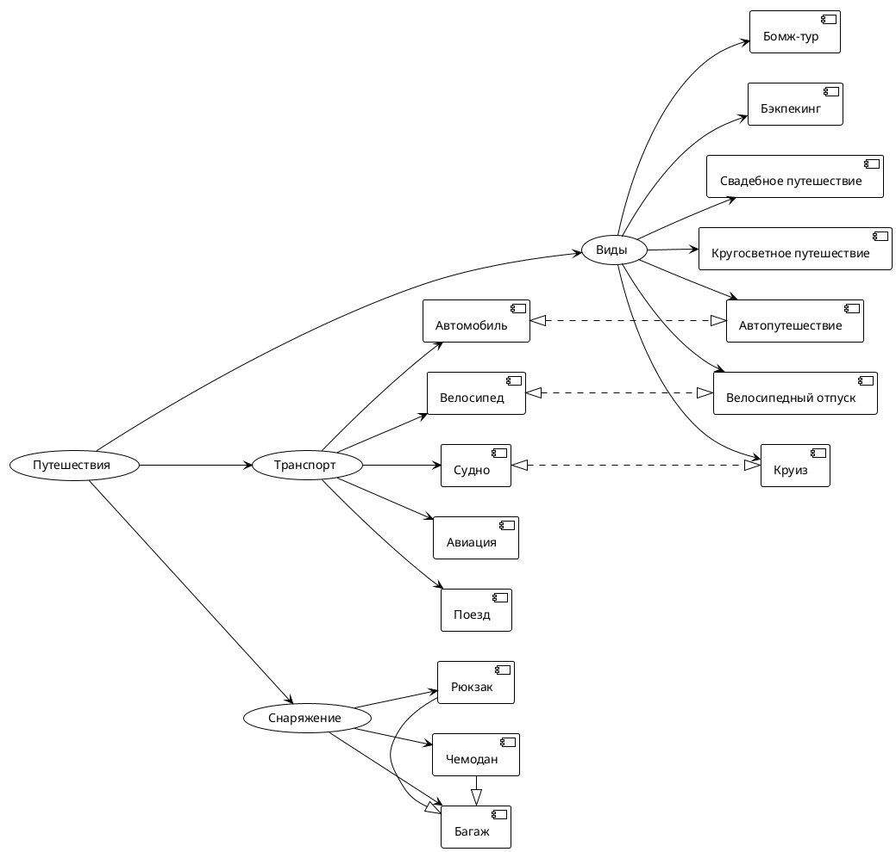

# Отчет по лабораторной работе

## Состав команды

| ФИО         |     Что делал             |Оценка |
|-------------|------------------|--------| 
| Мамонтов Егор Олегович         | 3 термина, редактирование книги, генерация с ИИ   | |
| Жаворонков Михаил Николаевич   | 3 термина, написание отчета, генерация с ИИ | |
| Юрков Евгений Юрьевич          | 3 термина, сбор информации, создание диаграмм, разработка терминов  | |
| Козырев Петр Андреевич         | 3 термина, написание скрипта для перекрестных ссылок в MD|  | 
|Муратов Артем Алексеевич        | 3 термина, написание скрипта для запросов к LLM|  |

## Концептуализация предметной области
Первым делом при написании детской книги при помощи ИИ мы определились со следующим: 

Так как книга рассчитана на детей, то мы хотим создать яркую, простую  и увлекательную книжку с примерами и понятным языком. Мы хотим, чтобы наша книга расширяла кругозор - давала детям понятные базовые понятия о путешествиях, странах, культурах, тем самым развивала любознательность. Одним из приемов привлечения внимания и поддержания интереса мы решили использовать большое количество эмодзи.

Искать и изучать информацию сразу начали с помощью wikidata. Изначально, для извлечения информации мы попытались использовать sparql запросы. Далее использовали wikidata visualization tool и в итоге пришлось немного подправить руками.  
Вот то, что получилось с помощью wikidata visualization tool и визуализации через PlantUML: 

## Написание текстов

Весь текст генерировался при помощи LLM API от GigaChat. Использовали модель GigaChat-Max.  Мы написали скрипт, который работает следующим образом: пользователь вводит название термина, далее скрипт отправляет запрос к GigaChat-Max, используя заранее подготовленный промпт:
"Объясни термин «[ТЕРМИН]» для десятилетнего ребенка. Используй большое количество эмодзи! Можешь использовать оформление текста для формата Markdown."

После получения ответа модель возвращает текст с объяснением, который сохраняется в файл формата .md в директории concepts/. Параметры модели temperature и top_p подобрали так, чтобы ответы были интересными, но не слишком случайными.

Ссылки расставляли при помощи скрипта : мы завели словарь терминов, ключом является термин, а значением - их соответствующие .md файлы. Например, если в тексте встретится слово "автопутешествие", оно заменится на `[автопутешествие](autotravel.md)`. 
В скрипте есть функция, которая открывает файл .md, читает его содержимое и переводит в нижний регистр, чтобы избежать ошибок из-за регистра букв. Потом проходит по всему словарю терминов,создает регулярное выражение (word_regex), чтобы найти слово в тексте файла и заменяет найденное слово на Markdown-ссылку - [термин](Report.md).

## Выводы
Нам понравился результат, который мы получили. В конечном итоге книжка получилась простой и увлекательной, а эмодзи сделали ее более живой и интересной. 

При работе со sparql столкнулись со следующими проблемами : например она выдавала несколько понятий "велик", и не могла сопоставить их с "велосипедным отпуском". Так же иногда нельзя было написать фильтры sparql, и LLM не могла особо помочь. 

В результате работы у нас получилась яркая, понятная и интерактивная энциклопедия, которая поможет детям узнать больше о путешествиях в интересной форме. В целом ИИ может упрощать и ускорять создание образовательного контента, делая его доступнее и увлекательнее, но нужен глаз человека, так как иногда LLM генерирует совсем не то что нужно. 
