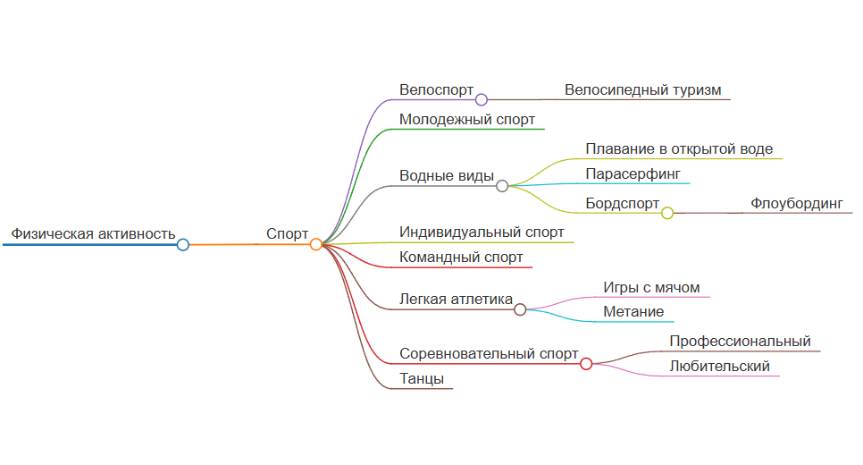

# Отчет по лабораторной работе

## Состав команды

| ФИО         | Что делал           | Оценка |
|-------------|----------------|--------|
| Басова Татьяна Валентиновна         | Организация работы команды |      |
| Кудинов Денис Викторович         | Архитектор онтологии | |
| Андрюшин Лев Дмитриевич         | Разработчик API-запросов |  |
| Корнев Максим Сергеевич        | Автоматизация ссылок | |
|Кайдалова Александра Андреевна| Ведение отчета | |

## Концептуализация предметной области

Наша команда провела комплексную работу по концептуализации предметной области "Физическая активность". Основной целью было создание структурированной онтологии, отражающей ключевые понятия и их взаимосвязи. В процессе работы мы использовали современные методы извлечения знаний из открытых баз данных и инструменты визуализации.  

Wikidata стала основным источником для получения структурированных данных о физической активности и смежных понятиях. Начальной точкой исследования стала сущность Q747883 (Physical activity). Было выявлено, что данная статья содержит ограниченный набор связей, что усложнило нам задачу. Для расширения графа знаний был разработан комплексный SPARQL-запрос, который можно посмотреть [тут](./spakql.sql). В нем используется фильтрация для исключения нерелевантных понятий, динамический поиск по иерархии. Запрос возвращает набор взаимосвязанных понятий, который визуализируется в виде [графа](./graph.png). Граф описывает связи сопоставленные непосредственно Wikidata. Кроме того, был получен файл [query.json](./query.json), в котором находятся идентификаторы интересующих нас статей и связи между ними.  

Также мы представили онтологию с помощью Markmap.js:  
  

## Написание текстов

При написание текстов, мы использовали LLM API программно, а именно обращались к GigaChat. В начале зарегестрировались на [сайте](https://developers.sber.ru/) и создали там новый проект. Изучив инструкции как подключаться к api, написали [код](./cod/AI_key.py), генерирующий токен (поместили его в файл token.txt), с помощью которого стало возможным обращаться к GigaChat. Этот токен действует 30 минут. Написав несколько сообщений к LLM, убедились в корректности подключения и правильности обращения.  

Для промта нам понадобились названия статей. Для их получения, написали [программу](./unique.py), читающую из [query.json](./query.json) и сохраняющую результаты в [enriched_articles.json](./enriched_articles.json). После, написали первый промт: «Привет, можешь объяснить на русском для 10 летнего ребенка что такое "{label}". Не пиши "Привет" и прочие вещи, просто выведи то, что я прошу. Твой ответ должен иметь определенную структуру (учти, что ответ должен быть в формате md файла, приведи весь текст грамотно к этому формату).» В данном промте {label} - это названия статей. Отправив сообщение и получив ответ, результат нас не устроил, так как информация была достаточно скудной. Поэтому мы добавили условие для объема информации: минимум 1000 символов. Кроме того, качество самого текста также можно было улучшить. Поигравшись с промтом, решили добавить в него топики из Wikidata, устранив эту проблему. Сбор топиков дописали в [программу](./unique.py), сделав запрос к Wiki API.  

Итоговый промт выглядит так: «Привет, можешь объяснить на русском что такое "{label}". Вот тебе небольшой текст с английской википедии: "{topic}". Перепеши его, будто объясняешь это для 10 летнего ребенка (на русском) и развей мысль. Ну и не пиши "Привет" и прочие вещи, просто выведи то, что я прошу. Объем должен быть минимум 1000 символов, можно больше. Твой ответ должен иметь определенную структуру (учти, что ответ должен быть в формате md файла, приведи весь текст грамотно к этому формату). Сделай его в формате небольшой статьи (и не забудь, что она должна быть такой, будто ты говоришь все это 10 летнему ребенку).»  

В итоге был написан [код](./cod/main.py), который отправляет сообщения GigaChat, используя промт, и создает Markdown-файлы в папке Articles к каждой статье, написанной LLM.

Приступив к созданию ссылок, мы вручную выписали в [файл](./cod/topics.json) все возможные словоформы названий статей, чтобы использовать их в автоматизации. В [коде](./cod/links.py) представлена сама автоматизация ссылок: загружаем словарь словоформ, обрабатываем все Markdown-файлы в папке Articles, сохраняя при этом исходные заголовки и структуру документов.  Для поиска и замены терминов используем регулярные выражения. В итоге из текста: "Велоспорт включает соревновательный спорт.", мы получаем: `"[Велоспорт](./cycling.md) включает [соревновательный спорт](./competitive_sport.md)."`, который корректно обробатывается в формате Markdown.

## Выводы

С какими сложностями столкнулись, какие решения применили, что получилось, что нет, что можно улучшить, ...
