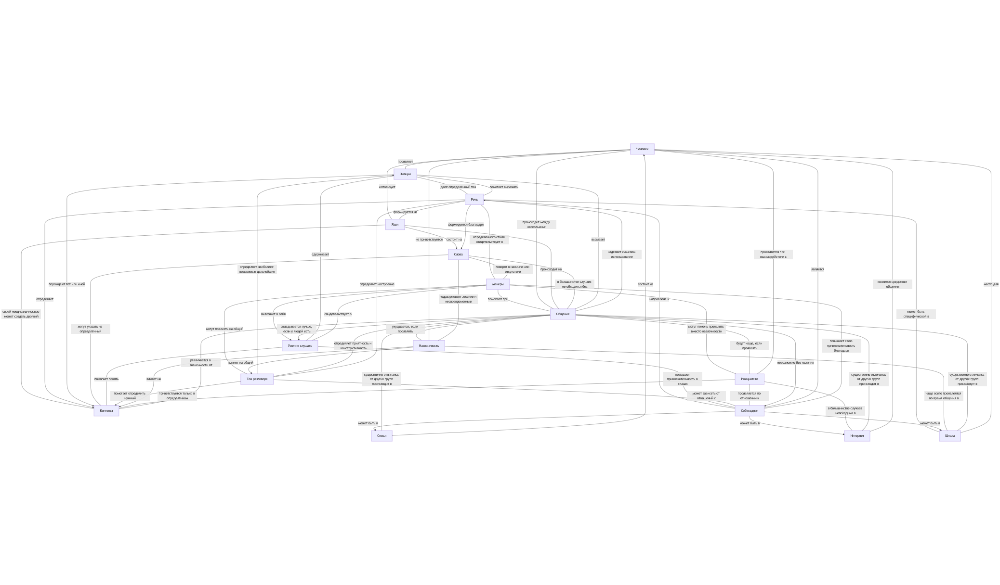

# Отчет по лабораторной работе

## Состав команды

| ФИО           | Что делал                                                                    | Оценка |
| :------------ | ---------------------------------------------------------------------------- | ------ |
| Титкова О.А.    | Генерация текстов, Python-скрипт                                        |        |
| Комбаров В.А | Генерация текстов, Онтология                                       |        |
| Лобанов О.А.  | Генерация текстов, Анализ современных тенденций                                                     |        |
| Коломытцева Е.А.    | Генерация текстов, Отчёт          |        |
| Филатов А.К. | Генерация текстов, Анализ современных тенденций |        |

## Концептуализация предметной области

При разработке детской энциклопедии с применением искусственного интеллекта нами была проведена концептуализация предметной области в несколько этапов, что позволило определить основные темы, целевую аудиторию, а также стиль текстового материала.

### Определение целевой аудитории и целей

Энциклопедия предназначена для детей школьного возраста и направлена на решение следующих задач:

- Создать увлекательный и понятный текст, способствующий развитию воображения и любознательности.
- Подобрать простую лексику и наглядные образы, соответствующие возрастным особенностям читателей.

### Анализ современных тенденций

Мы проанализировали современные детские материалы и выявили тенденции, которые использовали в своей энциклопедии:

- Акцент ставится на развитии **эмоционального интеллекта**: объясняются эмоции, чувства и способы их выражения. Популярны темы дружбы, конфликтов, понимания собеседника, умения слушать и выражать свои мысли конструктивно.
- Учитывая активное **использование детьми цифровых платформ**, энциклопедии включают разделы о правилах общения в интернете.

### Использованные инструменты

В работе мы использовали различные инструменты:

- **LLM (ChatGPT)** — выбран нами как одна из наиболее современных и доступных моделей.
- **Wikidata Visualization** — позволил изучить взаимосвязи между понятиями и уточнить структуру книги.
- **Mermaid.js** - помог наглядно представить структуры данных и концептуальные связи в виде удобных интерактивных диаграмм и схем.

Таким образом, мы прошли путь от первоначального анализа до визуализации и автоматизированной обработки ключевых понятий, используя возможности искусственного интеллекта и собственные исследования.

Мы решили выбрать определенные подклассы из WikiData, подходящие нам. Для извлечения подграфа знаний мы использовали SPARQL запросы: скрипт на Python. С помощью SPARQL запроса произвели фильтрацию всех объектов и отобразили на графе необходимые нам.

## Написание текстов

Весь текст книги был сгенерирован с помощью LLM. Мы использовали простой запрос: «Напиши страницу детской книжки в формате Markdown», после чего получали готовый текст в виде MD-файла.

Для автоматизации процесса ссылок на понятия был создан дополнительный Python-скрипт, который использует регулярные выражения для замены упоминаний ключевых понятий в тексте на Markdown-ссылки. Исходные данные для ссылок были загружены из файла concepts_clean.json, после чего выполнена обработка всех Markdown-файлов в директории проекта.

## Выводы

Процесс создания энциклопедии по теме «Общение» был увлекательным и творческим опытом. Получившийся результат нас порадовал: книга получилась привлекательной, полезной и доступной для детей школьного возраста. В ней простым языком раскрываются важные аспекты общения, которые помогут детям лучше понимать себя и окружающих, развивать эмпатию и эмоциональный интеллект. Мы уверены, что знакомство с энциклопедией будет не только познавательным, но и интересным.

Однако в процессе работы мы столкнулись с некоторыми трудностями. Тема общения многогранна и сложна, так как требует объяснения понятий, связанных с эмоциями, восприятием и социальными навыками, в доступной для детей форме. Особого внимания требовала тщательная проверка информации и подбор качественных примеров, которые были бы понятны и интересны детям. Несмотря на то, что модель LLM существенно облегчила задачу, предлагая базовые тексты и идеи, итоговый материал неоднократно редактировался нашей командой, чтобы достичь нужного уровня ясности и доступности.

Наш проект подтвердил, что LLM является ценным инструментом, способным ускорить процесс генерации текстов, предложить свежие идеи и автоматизировать часть рутинных задач. Тем не менее, по-настоящему качественный и гармоничный продукт получается только при активном участии человека, его творческого подхода и профессиональных знаний. Благодаря совместным усилиям нашей команды, энциклопедия стала живой и увлекательной книгой, которая, мы надеемся, будет полезна и интересна многим детям и их родителям.